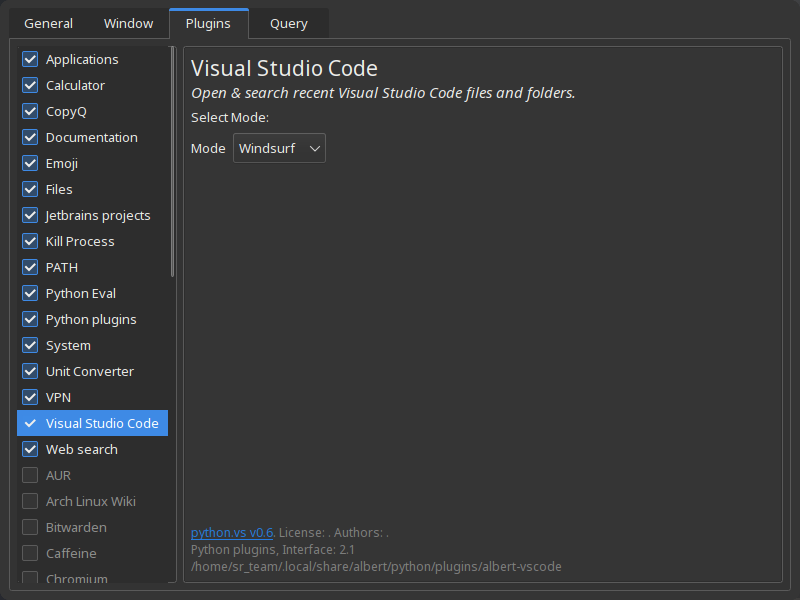
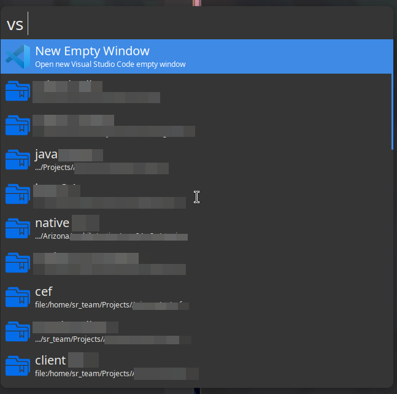
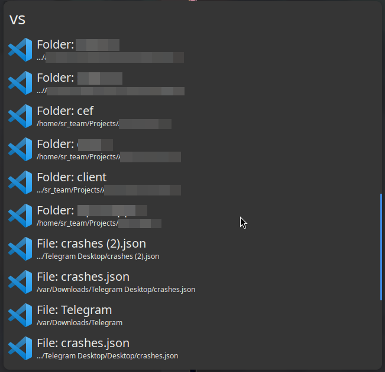

## The fork changes

### Add [Cursor](https://www.cursor.com/) and [Codeium Wingsurf](https://codeium.com/windsurf) support



### Load favorite projects from [alefragnani.project-manager](https://github.com/alefragnani/vscode-project-manager) extension

- Support filtering by tags
- Don't show disabled projects
- Don't show projects with invalid root path (e.g. from unmounted storages)



### Change recent view

- Show basename of folder/file in title
- Move full path to description
- Allow filter recents by type (file/folder)




# Below is original README

# albert-vscode

Simple [albert-launcher](https://github.com/albertlauncher/albert) extension that shows and opens recent Visual Studio Code files and folders.

The trigger to activate the extension is `vs`.


After the trigger you can insert the query to filter the results.


## Installation

To install the extension type the following in your terminal:

```
git clone https://github.com/mparati31/albert-vscode ~/.local/share/albert/python/plugins/vscode
```

Now active the extension: open albert's settings and go to `Python > Visual Studio Code` and check the checkbox.

## Note

- This extension may not work for older versions of Visual Studio Code, as the path to the `storage.json` file may be different or have a different structure.
- Rich text is temporary disabled due [issue#1164](https://github.com/albertlauncher/albert/issues/1164)
